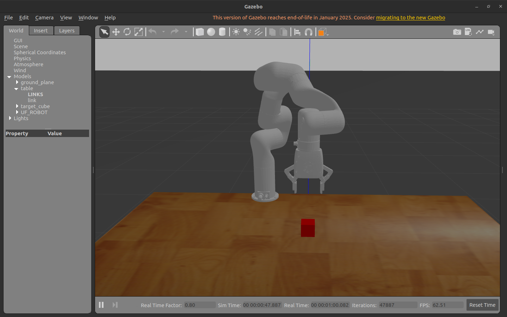
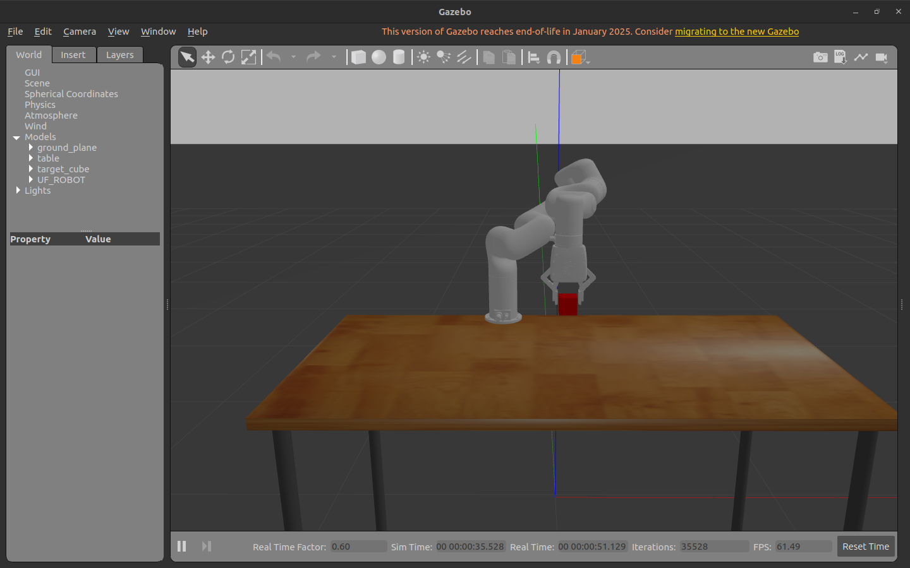

# 🤖 UFactory xArm7 ROS 2 Pick & Place with Gazebo Attachment

This project demonstrates a **complete pick-and-place simulation** using **ROS 2**, **MoveIt 2**, and **Gazebo**, including cube grasping, attachment, transport, and placement.

---

# 🚀 Overview

This project implements a structured robotic **pick-and-place pipeline** for the **xArm7 robotic manipulator**.

The system includes:

- ROS 2  
- MoveIt 2  
- Gazebo Simulation  
- Cartesian trajectory execution  
- Collision-aware manipulation  
- Gazebo cube attachment  
- Multi-stage pick-and-place motion  

The robot successfully picks a cube from a table surface and places it at a new location using safe motion planning.

---

# 📸 Gazebo Simulation Results

These images automatically appear when the README is opened on GitHub.

---

## 🌍 Gazebo — Before Grasp

Initial setup showing the cube resting on the table before the robot grasps it.



---

## 🧲 Gazebo — After Grasp (Cube Attached)

Cube attached to the robot gripper during transport.



---

# 🎥 Pick-and-Place Simulation Video

[▶️ Watch Pick-and-Place Simulation Video](PASTE_YOUR_VIDEO_LINK_HERE)

---

# ✨ Key Features

Main implementation file:
xarm_planner/test/test_xarm_pick_place.cpp

Core functionality includes:

- MoveIt motion planning  
- Cartesian trajectory execution  
- Collision object creation  
- Gazebo cube attachment  
- Structured stage-based motion  
- Gripper control integration  

---

# 📦 Planning Scene Configuration

The simulation dynamically creates the working environment.

## 🔴 Target Cube

- Shape: Box  
- Size: 0.05 × 0.05 × 0.05 m  
- Frame: `world`

Position:
x = -0.34
y = -0.20
z = 0.025

---

## 🟫 Table Surface

- Shape: Box  
- Size: 1.5 × 0.8 × 0.01 m  
- Purpose: Provides support surface and realistic collision environment  

---

# 📍 Pick-and-Place Motion Sequence

The robot executes the following stages:

1. Move to approach position  
2. Cartesian lowering to pick position  
3. Close gripper  
4. Attach cube in Gazebo  
5. Lift object  
6. Move to place position  
7. Lower to place  
8. Open gripper  
9. Detach cube in Gazebo  
10. Move upward to clear  

---

# 📐 Motion Pose Definitions

| Stage | Position (x, y, z) |
|------|--------------------|
| Approach Pick | (-0.34, -0.20, 0.15) |
| Pick | (-0.34, -0.20, 0.015) |
| Lift | (-0.34, -0.20, 0.15) |
| Above Place | (-0.34, -0.40, 0.15) |
| Place | (-0.34, -0.40, 0.020) |
| Clear | (-0.34, -0.40, 0.15) |

---

# 🤏 Gripper Configuration

| Action | Joint Values |
|-------|---------------|
| Open | [0.0]*6 |
| Close | [0.42]*6 |

---

# 🔗 Gazebo Object Attachment

This project uses:
linkattacher_msgs


Services:


/ATTACHLINK
/DETACHLINK

These allow:

- Physical attachment of cube to gripper  
- Realistic grasp simulation  
- Stable transport during motion  
- Proper release at target location  

---

# 🚀 Running the Simulation

## Build

```bash
colcon build --packages-select xarm_planner
source install/setup.bash
```
## Gazebo Simulation
```bash

ros2 launch xarm_planner xarm7_planner_gazebo.launch.py \
dof:=7 robot_type:=xarm add_gripper:=true

ros2 launch xarm_planner test_xarm_pick_place.launch.py \
dof:=7 robot_type:=xarm \
add_gripper:=true \
add_vacuum_gripper:=false
```
## 📂 Project Structure
```bash
xarm_ros2/
│
├── xarm_planner/
│   ├── test/
│   │   └── test_xarm_pick_place.cpp
│   │
│   ├── launch/
│   │   └── test_xarm_pick_place.launch.py
│
├── images/
│   ├── gazebo_before_grasp.png
│   └── gazebo_after_grasp.png
│
└── README.md
```
## 🔮 Future Work
Vision-based object detection (OpenCV / AI) <br>
Multi-object manipulation <br>
Dynamic target selection <br>
Mobile robot integration (AGV) <br>
MoveIt Task Constructor (MTC) workflow <br>
## 👤 Author

Brian Kiprono
Robotics | ROS 2 | Automation Systems

## ⭐ Acknowledgements
UFACTORY xArm platform <br>
ROS 2 community <br>
MoveIt 2 developers <br>
Gazebo simulation team

